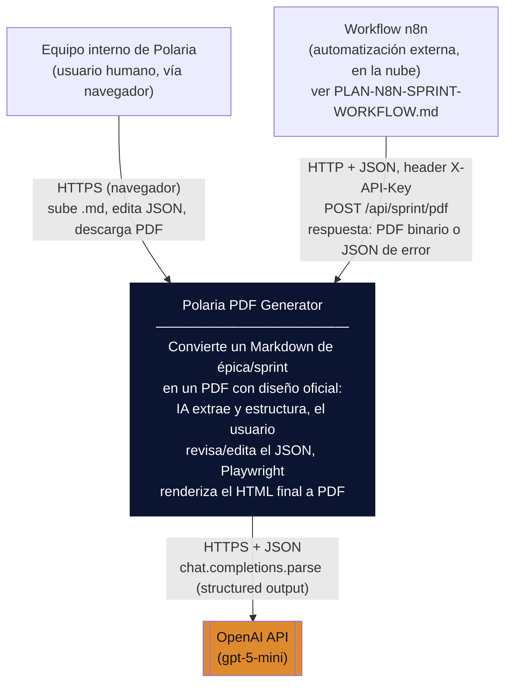
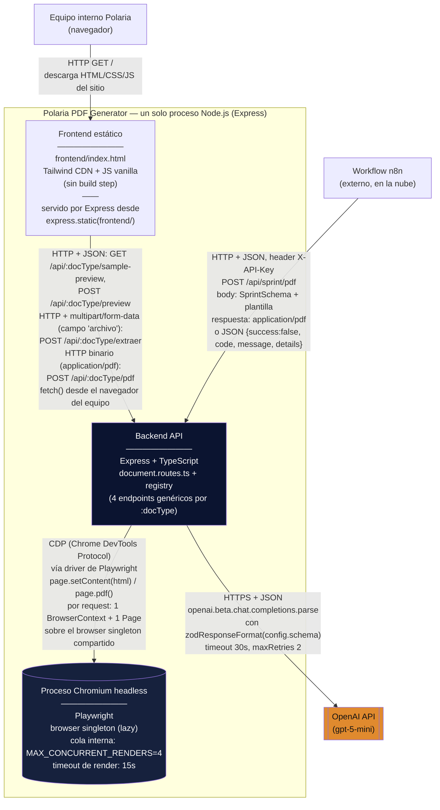

# Arquitectura — Polaria PDF Generator

Este documento describe la arquitectura real del sistema tal como existe en el código (verificado contra `backend/src/server.ts`, `backend/src/api/document.routes.ts`, `backend/src/documents/registry.ts`, `backend/src/documents/types.ts`, `backend/src/core/ai/extractor.service.ts`, `backend/src/core/generators/pdf.generator.ts` y `frontend/index.html`). Los diagramas siguen el modelo C4 (niveles 1 y 2) y están embebidos en Mermaid directamente en este Markdown — este archivo **es** el archivo fuente versionado de los diagramas; no existe un `.mmd` separado porque no hace falta: Mermaid embebido en Markdown ya vive y se versiona junto al código.

Última verificación de contenido: 2026-07-13, contra el estado del repo en la rama `main` (incluye cambios aún no commiteados de `pdf.generator.ts`, `document.routes.ts`, `server.ts` y `constants.ts` — ver `git status`).

## 1. Diagrama de contexto (C4 Nivel 1)

El sistema como caja negra: quién lo usa y con qué servicios externos habla.



**Notas de la caja negra:**
- No hay base de datos ni cola de mensajes: el sistema no persiste documentos generados ni estado de sesión entre requests (ver sección 4).
- El workflow n8n es un actor **externo** al sistema (no un contenedor propio): solo consume el mismo endpoint público `POST /api/sprint/pdf` que cualquier otro cliente HTTP, autenticado con una API key (ver ADR-0005). Su lógica interna (agente de IA, Google Sheets, Google Drive, Linear) vive fuera de este repositorio.
- Límite de confianza: todo lo que está dentro de la caja "Polaria PDF Generator" corre en el servidor (proceso Node.js); el navegador del equipo interno y el propio n8n están fuera de ese límite de confianza — por eso la comunicación hacia el backend requiere autenticación cuando el backend está expuesto públicamente (ADR-0005).

## 2. Diagrama de contenedores (C4 Nivel 2)

Los contenedores reales dentro del sistema y cómo se comunican, con protocolo y forma del dato en cada conexión.



**Aclaración sobre el "contenedor" frontend:** físicamente el frontend no es un proceso separado — es un único archivo estático (`frontend/index.html`) servido por el mismo proceso Express vía `express.static(path.join(__dirname, "..", "..", "frontend"))` (`backend/src/server.ts:46`). Se dibuja como contenedor aparte porque en términos C4 es una unidad de tecnología distinta (HTML/CSS/JS que se ejecuta en el navegador del cliente, sin build step, Tailwind por CDN), aunque comparta proceso de despliegue con el backend.

**Aclaración sobre el "contenedor" Chromium:** no es un servicio de red aparte — es un proceso OS hijo lanzado por Playwright (`chromium.launch()`) dentro del mismo proceso Node.js, controlado vía el protocolo CDP (Chrome DevTools Protocol) a través del driver de Playwright, no vía HTTP. Se lanza una sola vez de forma perezosa (singleton, ver ADR-0003) y cada request abre solo su propio `BrowserContext`/`Page` sobre ese browser compartido, limitado por una cola interna de `MAX_CONCURRENT_RENDERS = 4` (semáforo en memoria, no un broker de mensajes — ver sección 4).

### Detalle de los 4 endpoints (idénticos para cualquier `docType` registrado)

| Endpoint | Protocolo / payload | Respuesta de éxito | Quién lo llama hoy |
|---|---|---|---|
| `GET /api/:docType/sample-preview` | HTTP, query opcional `?plantilla=` | `text/html` (HTML crudo, para `<iframe>`) | Frontend |
| `POST /api/:docType/extraer` | HTTP + `multipart/form-data`, campo `archivo` (.md) | JSON `{ success:true, datos, uso }` | Frontend |
| `POST /api/:docType/preview` | HTTP + JSON, `body.datos` o body directo, `body.plantilla` opcional | `text/html` (HTML crudo) | Frontend |
| `POST /api/:docType/pdf` | HTTP + JSON, mismo body que `/preview` | `application/pdf` (binario) | Frontend y workflow n8n (`docType=sprint`) |

Todas validan `config.schema.safeParse(...)` antes de procesar; el error de validación se devuelve como `{ success:false, code:"VALIDATION_ERROR", message, details: zodError.flatten() }` — la misma forma que consume tanto el frontend como el workflow de n8n (ver `PLAN-N8N-SPRINT-WORKFLOW.md`, paso 8).

## 3. Patrón document-type (registry)

Este es el patrón arquitectural central del proyecto (ver ADR-0001). En vez de una ruta Express por cada tipo de documento, hay **un solo set de 4 rutas genéricas** parametrizadas por `:docType`, y cada tipo de documento es un módulo autocontenido que implementa un contrato común.

### El contrato: `DocumentConfig<T>` (`backend/src/documents/types.ts`)

```ts
export interface DocumentTemplate {
  path: string;
  pdf?: {
    width: string;
    height: string;
  };
}

export interface DocumentConfig<T> {
  id: string;
  schema: z.ZodSchema<T>;
  systemPrompt: string;
  componerDatos(datosExtraidos: T): any;
  templates: Record<string, DocumentTemplate>;
  defaultTemplate: string;
}
```

- **`id`**: la clave usada en la URL (`/api/:docType/...`) y en el registro.
- **`schema`**: contrato Zod único — lo usa la extracción por IA (`zodResponseFormat`), la validación de `/preview` y `/pdf`, y define el tipo TypeScript (`z.infer`).
- **`systemPrompt`**: instrucciones de dominio para la extracción con OpenAI, específicas de ese tipo de documento.
- **`componerDatos(datosExtraidos)`**: enriquece los datos ya validados con lo que la plantilla necesita pero el schema no captura (colores, agregados, porcentajes) — nunca al revés; las plantillas Handlebars no tienen helpers custom, todo el cálculo vive acá.
- **`templates`**: un documento puede tener más de una plantilla HTML registrada bajo distintas claves, cada una con su propio `pdf.width`/`pdf.height` (ver ADR-0004 sobre por qué el `height` es solo un mínimo).
- **`defaultTemplate`**: la clave usada si el caller no manda `plantilla` o manda una que no existe en `templates`.

### El registro (`backend/src/documents/registry.ts`)

```ts
export const documentRegistry: Record<string, DocumentConfig<any>> = {
  [epicaConfig.id]: epicaConfig,
  [sprintConfig.id]: sprintConfig,
};

export function getDocumentConfig(docType: string): DocumentConfig<any> | null {
  return documentRegistry[docType] ?? null;
}
```

Las 4 rutas de `document.routes.ts` empiezan siempre igual: `const config = getDocumentConfig(req.params.docType)`; si es `null`, responden `404 NOT_FOUND` de forma uniforme. No hay ningún `if (docType === "epica")` disperso por el código de rutas.

### Los dos documentos reales hoy

| `docType` | Templates registradas | `defaultTemplate` | Notas |
|---|---|---|---|
| `epica` | `default` (`1240×1050px`, tamaño por defecto) | `default` | Resumen ejecutivo mensual; `horas` sale siempre de `HORAS_FIJAS` en `constants.ts`, no del JSON. |
| `sprint` | `detail` (`900×1188px`), `resumen-inicio` (`1240×1050px`), `resumen` (`1240×1050px`), `resumen-v2` (`1240×1050px`) | `detail` | Único documento con más de una plantilla; `horas.segmentos` sí es editable por request. |

### Extensibilidad (por qué existe el patrón)

Agregar un tipo de documento nuevo no toca `document.routes.ts`: se crea `backend/src/documents/<tipo>/` con `config.ts` (schema + prompt + `componerDatos` + `templates`) y `sample-data.ts`, se registra en `registry.ts` (dos líneas: `documentRegistry` y `documentSamples`), y se agrega la entrada correspondiente al objeto `DOCUMENTS` de `frontend/index.html` para que aparezca como tab en la UI. Ver ADR-0001 para el razonamiento completo y las alternativas consideradas.

## 4. Servicios externos

| Servicio | Para qué se usa | Dónde está configurado |
|---|---|---|
| **OpenAI API** (`gpt-5-mini`) | Único servicio externo del sistema. Convierte el Markdown subido en el JSON estructurado de cada `docType`, vía `openai.beta.chat.completions.parse` con `response_format: zodResponseFormat(config.schema, ...)` — fuerza a la respuesta a cumplir el schema Zod exacto. `temperature: 0.2`, `timeout: 60_000ms`, `maxRetries: 1` (ver `backend/src/core/ai/extractor.service.ts`). | `backend/src/constants.ts` → `PRECIO_GPT5MINI` (`modelo: "gpt-5-mini"`, `usdPorMillonEntrada: 0.25`, `usdPorMillonSalida: 2.0`) y `backend/.env` → `OPENAI_API_KEY`. |

**No hay base de datos.** El sistema no persiste documentos generados, historial de extracciones, ni sesiones — cada request es autocontenido (sube un `.md`, o manda un JSON ya editado, y recibe HTML o PDF en la misma respuesta). Los únicos datos "fijos" del dominio (`HORAS_FIJAS`, `PALETAS` en `constants.ts`, y `sample-data.ts` por documento) están hardcodeados en el código fuente, no en una tabla ni en un archivo de estado externo.

**No hay cola de mensajes.** La "cola" de `MAX_CONCURRENT_RENDERS = 4` en `pdf.generator.ts` es un semáforo hecho a mano en memoria de proceso (un array de callbacks pendientes), no un broker de mensajes (no hay RabbitMQ/SQS/Redis de por medio) — no sobrevive a un reinicio del proceso ni se comparte entre instancias si el backend llegara a escalar horizontalmente.

## 5. Referencias cruzadas

- Razonamiento detrás de cada decisión marcada arriba: ver `docs/adr/` (`0001` patrón document-type, `0002` stack Handlebars/Playwright/Zod/OpenAI, `0003` browser singleton + cola, `0004` alto de PDF auto-ajustable, `0005` auth por API key).
- Plan de integración con n8n (actor externo del diagrama de contexto): `PLAN-N8N-SPRINT-WORKFLOW.md` en la raíz del repo.
- Guía de arquitectura para contribuir código nuevo: `CLAUDE.md` en la raíz del repo.
